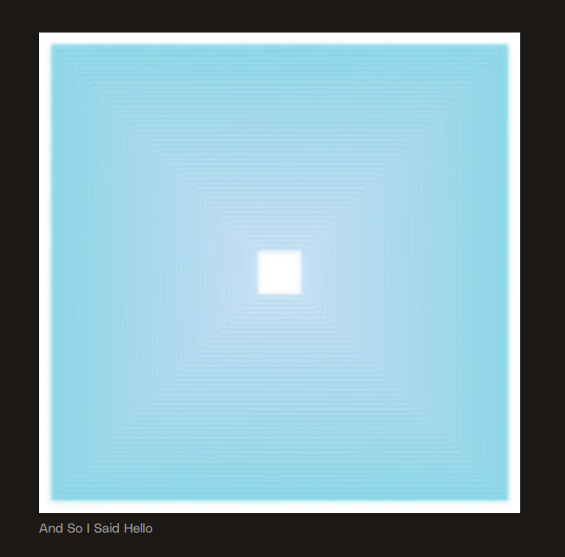

# Interactive Procedural Recreation of *And So I Said Hello*

## Overview
This project is an interactive procedural recreation of Tyler Hobbs' *And So I Said Hello* using TouchDesigner. It leverages procedural logic to dynamically generate structured visuals, closely following the algorithmic nature of the original artwork. The recreation includes real-time interactivity, with spectrum analysis and microphone input affecting visual elements.

## Features
- **Procedural Generation**: Shapes and transformations are driven by algorithmic rules.
- **Feedback Loops**: Used to create dynamic layering and evolving visuals.
- **Audio-Reactive Elements**: Spectrum analysis and microphone input influence the artwork in real time.
- **Composition Techniques**: Inspired by Tyler Hobbs' structured generative approach.

## About Tyler Hobbs
Tyler Hobbs is a generative artist known for using algorithms to create rule-based, structured compositions. His work often explores the intersection of randomness and control, producing visually engaging patterns through computational methods.

## Images
### Original Artwork

### Procedural Recreation

## Requirements
- TouchDesigner
- Microphone (for real-time audio input)

## Usage
1. Open the TouchDesigner project file.
2. Ensure a microphone is connected for spectrum analysis features.
3. Run the project and interact with audio to see real-time changes.
